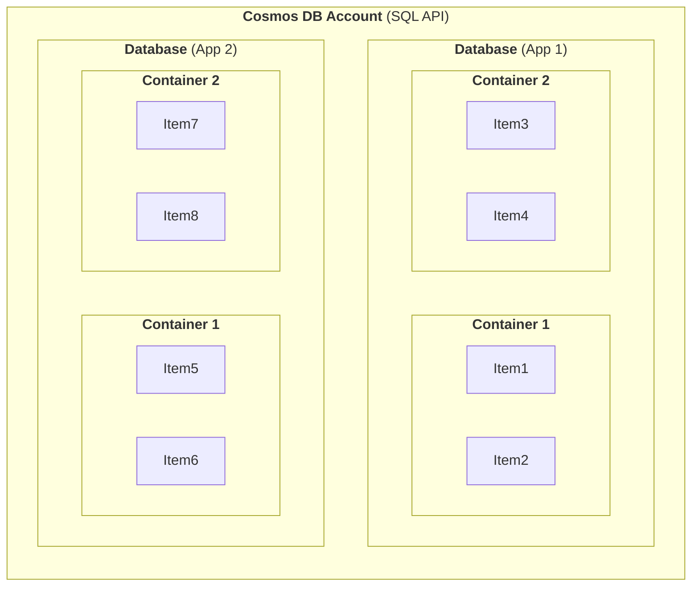

# Notes Azure Cosmos
Cosmos DB supports multiple NoSQL data models, including document, key-value, graph, and column-family, and provides APIs for popular programming languages and platforms.

Cosmos DB is designed for building highly responsive and globally available applications that require seamless data access and synchronization across multiple regions and devices.

## Cosmos DB Organization

## Cosmos DB API's
- SQL
- Cassandra
- MongoDB
- Gremlin
- Azure Table

## Database Entity
- **SQL** -> Database
- **Cassandra** -> Keyspace
- **MongoDB** -> Database
- **Gremlin** -> Database
- **Azure Table** -> Not Applicable

## Container Entity
- **SQL** -> Container
- **Cassandra** -> Table
- **MongoDB** -> Collection
- **Gremlin** -> Graph
- **Azure Table** -> Table

## Request Unit (RU)
A Request Unit (RU) is a measure of throughput or resource consumption. It represents the amount of processing required to handle a single request for a specific amount of data. 

As a baseline, one RU is equal to a 1kb item read operation from a Cosmos DB container.

## Best Practices
- Use a partition strategy to evenly spread throughput on partitions
- Provision throughput at the container for predictable performance
- Use the serverless account type for development workloads
- Understand the link between consistency types and the amount of RU's consumed

## Consistency Level Spectrum

- **Eventual Consistency** (Lower Latency, Higher Throughput, Higher Availability)
  - No guarantee for order
- **Consistent Prefix**
  - Guarantees that updates are returned in order
- **Session Consistency**
  - Guarantees that a client session will read its own writes
- **Bounded Staleness**
  - Guarantees that a read has a max lag (either versions or time)
- **Strong Consistency** (Higher Latency, Lower Throughput, Lower Availability)
  - Guarantees that reads get the most recent version of an item

## Throughput Considerations
>Both strong and bounded staleness reads will consume twice the normal amount of request units (RU) for a request, as Consmos DB will need to query two replicas to meet the criteria of the consistency level.

## Partitioning Data in Cosmos DB

### Logical Partition
- A set of items within a container that share the same partition key - Basically all items in a logical partition have the same partition key value
- A container can have as many logical partitions as it needs, but each partition is limited to 20GB of storage
- Managed by Cosmos, but governed by partition key strategy

### Physical Partition
> A container is scaled by distributing data and throughput across **physical partitions**. Internally, one or more logical partitions are mapped to a single physical partition. They are entirely managed by Azure Cosmos DB.

### Partition Key
- Helps routing request to the correct partition
- Made up of both the key and the value of the defined partition key
  - Partition Key Components: 
    - Partition Key Path: /CityName
    - Partition Ket Value: Dallas
- Should be **a value that does not change for the item**
- Should have many different values represented in the container
- Workload Considerations
  - Pick a partition key value that appears frequently as a filter
  - Use item id to ensure cardinality of partition keys
  - For a read heavy container, we may wish to chose a partition key property that appears frequently as a filter in the query that we perform
  - For a write heavy container, we may want to use Id of a document as our partition key value.
- **Hot Partition**

### Cross-Partition Queries
- Queries that don't filter on partition keys
- Queries must fan out to all physical partitions
- Effectively run the query against each physical partition
- Must wait for each query to finish before getting result

### Replica Set
>A physical partition contains multiple replicas of the data, knows as a replica set. By having this data replicated, you enable your storage to be durable and fault tolerant. These replica sets are managed by Azure Cosmos DB.

## Cosmos DB Server-side Concepts
- Stored Procedures (Supported when using SQL API)
- Triggers (Supported when using SQL API)
- User Defined Functions (Supported when using SQL API)
- Change Feed

